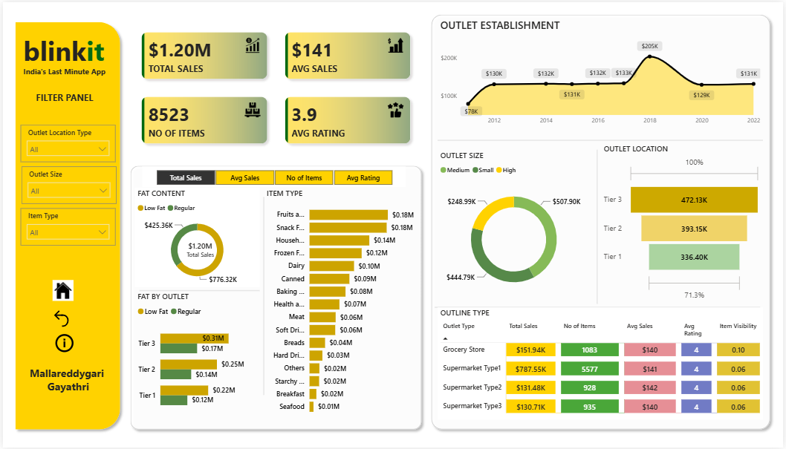

# BlinkIT Grocery Sales Analysis


An end-to-end sales analytics project on BlinkIT's grocery outlet data - combining **SQL-based data cleaning and KPI analysis** with an **interactive Power BI dashboard** to uncover sales trends across item types, outlet formats, and locations.

---

## Dashboard Preview



The Power BI dashboard summarizes total sales, average sales, order volume, and customer ratings, with breakdowns by fat content, item type, outlet size, outlet location, and outlet type - all filterable by Outlet Location Type, Outlet Size, and Item Type.

**Key headline metrics:**
| Metric | Value |
|---|---|
| Total Sales | $1.20M |
| Average Sales | $141 |
| No. of Items | 8,523 |
| Average Rating | 3.9 |

---

## Repository Contents

| File | Purpose |
|---|---|
| `BlinkIT_Grocery_Data.xlsx` | Source dataset used to build the **Power BI dashboard** |
| `BlinkIT_Grocery_Data.csv` | Same dataset in CSV format, used for the **MySQL** data cleaning and analysis |
| `BlinkIT_PowerBI_Dashboard.pbix` | Power BI dashboard file (interactive report) |
| `Blinkit_analysis.sql` | SQL script covering data cleaning, KPI calculation, and analytical queries |

---

## Tools & Technologies

- **MySQL Workbench** - data cleaning, KPI calculation, and analytical queries
- **Power BI** - interactive dashboard and visualization
- **Excel/CSV**- source data formats for Power BI and MySQL respectively

## Data Cleaning

The `Item Fat Content` field contained inconsistent category labels (`LF`, `low fat`, `reg`, etc.). A `CASE`-based `UPDATE` statement standardized these into two clean categories - **Low Fat** and **Regular** — affecting 1,721 of 8,523 rows.

```sql
UPDATE `blinkit grocery data`
SET `Item Fat Content` =
    CASE
        WHEN `Item Fat Content` IN ('LF', 'low fat') THEN 'Low Fat'
        WHEN `Item Fat Content` = 'reg' THEN 'Regular'
        ELSE `Item Fat Content`
    END;
```

## Key Analyses (SQL)

1. **Core KPIs** — Total Sales, Average Sales, Order Count, Average Rating
2. **Total Sales by Fat Content** — Low Fat items generate nearly double the revenue of Regular items
3. **Total Sales by Item Type** — Fruits & Vegetables and Snack Foods lead all 16 categories
4. **Fat Content by Outlet Location** — row-to-column pivot via conditional aggregation (`SUM(CASE WHEN ...)`), since MySQL lacks a native `PIVOT` operator
5. **Sales by Outlet Establishment Year** — outlets established in 1998 lead total sales
6. **Sales Share by Outlet Size** — Medium-sized outlets account for 42.27% of total sales, the largest share
7. **Sales by Outlet Location Type** — Tier 3 locations generate the highest total sales
8. **All Metrics by Outlet Type** — Supermarket Type1 leads on revenue, item count, and rating

## Key Insights

- **Low Fat items outperform Regular items**, generating ~$776K vs. ~$425K in total sales.
- **Fruits & Vegetables and Snack Foods** are the top-selling item categories.
- **Tier 3 outlets** contribute the highest total sales among all location types.
- **Medium-sized outlets** capture the largest share of sales (42.27%).
- **Supermarket Type1** dominates across revenue, item count, and average rating — making it the strongest-performing outlet format.
- Average customer rating is consistent across outlet types (~3.9–4.0), indicating stable customer satisfaction regardless of format.

## How to Use

1. Open `BlinkIT_Grocery_Data.csv` in MySQL Workbench and run `Blinkit_analysis.sql` to reproduce the data cleaning and KPI queries.
2. Open `BlinkIT_PowerBI_Dashboard.pbix` in Power BI Desktop, which is built on `BlinkIT_Grocery_Data.xlsx`, to explore the interactive dashboard.

## Author

**Mallareddygari Gayathri**
[GitHub](https://github.com/Gayathri-Reddy874)

## License

This project is licensed under the [MIT License](./LICENSE).
